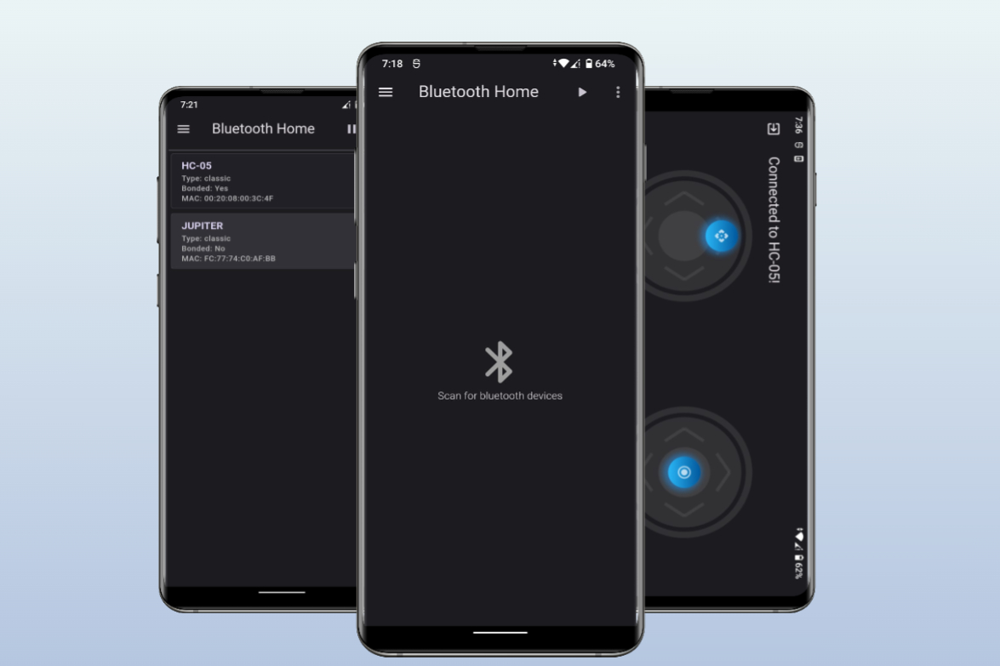

<h1 align="center"></h1>

_
A simple IoT based Application
_

  

## Smart Link

> An application to remotely control Arduino, HC-05/06 and ESP8266 (Node-MCU) IoT based devices.

## Features

-   [x] User authentication
-   [x] User feedback
-   [x] Bluetooth controller to communicate with HC-05/06 modules with arduino
-   [x] Communication with ESP8266 module via http requests
-   [x] Device Fingerprint Authentication to communicate with ESP8266 via Firebase RTDB

  

## Architecture:

  

## Hardware Repositories:

1. **<a href="https://github.com/mediocre9/arduino-uno-robot">Arduino Uno Robot</a>**
2. **<a href="https://github.com/mediocre9/nodemcu-esp8266">(SoC) ESP8266 NodeMCU</a>**
3. **<a href="https://github.com/mediocre9/nodemcu-touchpass">(SoC) ESP8266 NodeMCU - Firebase</a>**

## Design Considerations

-   Command strings for the HC-05 that are hardcoded was a design choice of my University's Robotics Club. You can customize the [Bluetooth Remote Control](https://github.com/mediocre9/smart-link/blob/main/lib/screens/bluetooth_remote_screen/cubit/bluetooth_remote_cubit.dart) module to change commands or add a new feature like saving commands with shared preferences.
-   The app enforces user authentication, which means that you will be prompted to sign in each time you open the app.

## License

This project is licensed under the MIT License. See the [LICENSE](https://github.com/mediocre9/smart-link/blob/main/LICENSE) for details.
