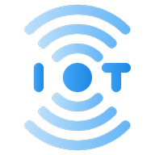
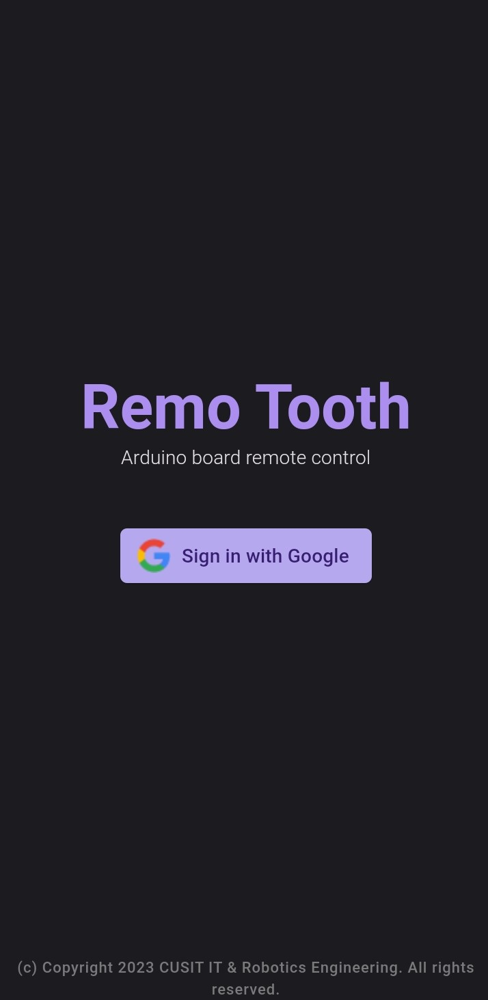
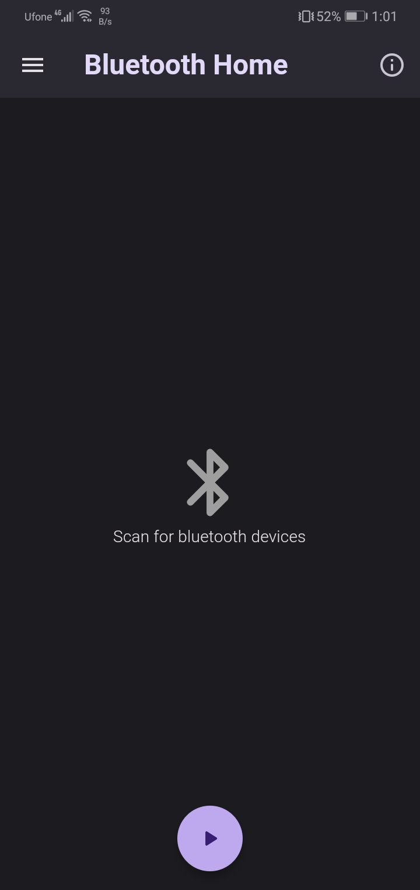
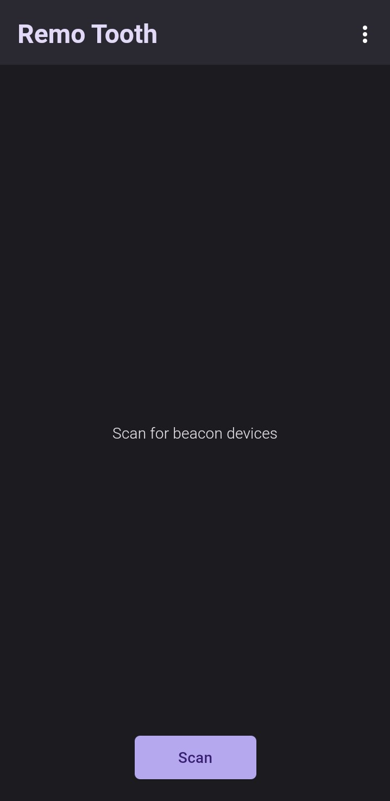
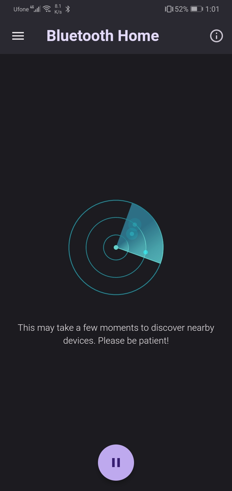

  

  <h1 style="color: lightblue;"><b>Smart Link</b></h1>

An application to remotely control arduino based robot via bluetooth and wifi technology.

## Stable Version: <a href="https://github.com/mediocre9/remo-tooth/releases/tag/v0.3.0">0.3.0</a>

## How it works?

It scans for nearby beacon devices to establish connection between them. Then it send signals to the connected end-device to perform operations.

## Development Branches:
- **<a href="https://github.com/mediocre9/remo-tooth/tree/development">Development</a>**
- **<a href="https://github.com/mediocre9/remo-tooth/tree/integration">Integration</a>**

## Task-List:
- [x] UI Rework
- [x] UI Responsiveness 
- [ ] Unit Testing
- [ ] Integration Testing
- [ ] Regression Testing
- [ ] Refactoring

## Dependencies:
- flutter_bloc: 8.1.1
- bloc: 8.1.0
- flutter_bluetooth_serial: 0.4.0
- connectivity_plus: 3.0.2
- lottie: 2.2.0
- http: 0.13.5

## Build Previews:

  
  
  
  

