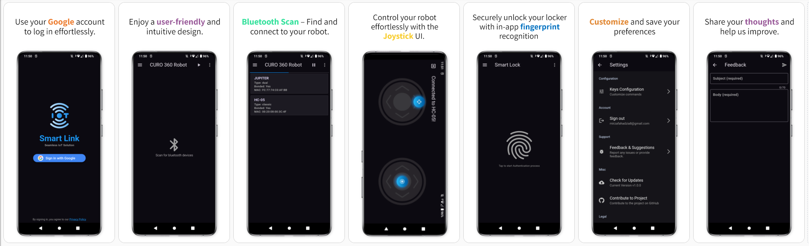

<h1 align="center"></h1>

_
A simple IoT based Application
_

  

## Smart Link

> An IoT application designed for remote control and management of various devices, including Arduino, HC-05/06, ESP32 or ESP8266 (Node-MCU). The app offers features such as Google authentication, user feedback, in-app update checker and Bluetooth communication. It enables users to control robots and does also provides fingerprint biometric authentication for secure locker access through ESP32 firmware.

**⚠️ Note: The current mobile app release is incompatible with the latest firmware of <a href="https://github.com/mediocre9/esp-32-smart-safe-locker">ESP32 Smart Safe Locker Firmware</a>. Updating soon!**

## Previews

  

## Features

-   [x] Google Oauth.
-   [x] User feedback system.
-   [x] In-app update checker.
-   [x] Crashlytics support. 
-   [x] Account revocation system to restrict app access.
-   [x] Save Robot commands using shared preferences.
-   [x] Bluetooth control for serial communication with HC-05/06 modules on Arduino to control the robot.
-   [x] Fingerprint biometric authentication to securely unlock lockers, communicating with ESP32.

## Architecture:

  

## Firmware Repositories:

1. **<a href="https://github.com/mediocre9/arduino-uno-robot">Arduino Uno Robot</a>**
2. **<a href="https://github.com/mediocre9/esp-32-smart-safe-locker">ESP32 Smart Safe Locker Firmware</a>**

## License

This project is licensed under the MIT License. See the [LICENSE](https://github.com/mediocre9/smart-link/blob/main/LICENSE) for details.
